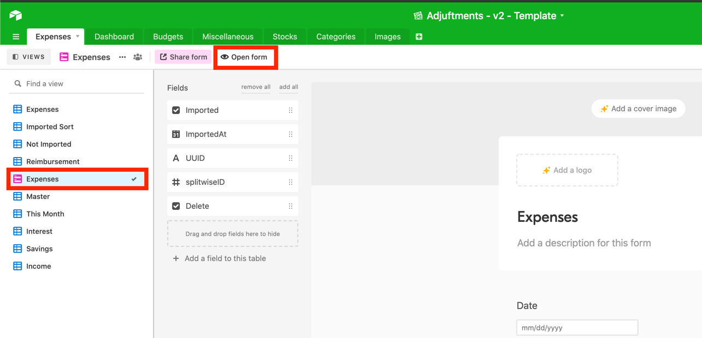
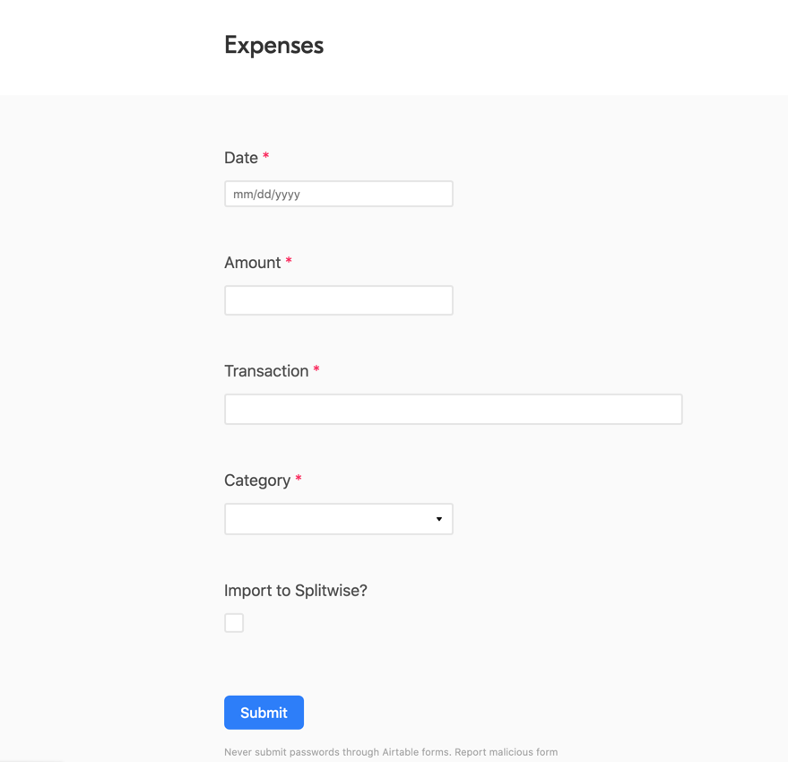

# `adjuftments` Expense Entry

## Airtable Form Setup

The `Expenses` table on `airtable` has a view that becomes a public facing form. My best
recommendation is to save the URL and add it to your home screen using
[iOS Safari or Android Chrome](https://natomasunified.org/kb/add-website-to-mobile-device-home-screen/)
.

## Parts of Submitting an Expense

- `Date`: Expense Date
- `Amount`: Expense Amount
- `Transaction`: Expense Transaction
    - This transaction typically has 2 parts and is split with spaces and a
      hypen (` - `): `<vendor> - <description>`
    - Adding an additional field (separated by the hyphen and spaces) enables some functionality on
      certain transaction categories such as savings (`<vendor> - <description> - <bank account>` )
- `Category`: Expense Category
- `Splitwise`: Check this box to create a splitiwse expense
    - the eventual transaction amount will be half of the `Amount` provided

## Entering Expenses

Entering expenses into Adjuftments is pretty straightforward, with a few tips and tricks. Once you
submit an expense through the form, `adjuftments` picks up the expense, loads it in the database and
marks it as `imported` inside of `airtable`.

Let's begin with some common examples of creating new expenses

1) Submitting a Savings Transaction
    - Did you move money from your `checking` to a `savings` account?
        - Great, submit the expense like normal. I will usually put something
          like `"Ally - January Savings"` as the transaction. This will move whatever amount you
          indicate from checking to whichever account you select. *Don't select your checking
          account here, it will be overwritten with your default savings account on import*

    - Did you move money from your `savings` to `checking` account?
        - Awesome. Do what you did above, just make the amount a negative number

    - Spending Money Directly from the Savings Account
        - There are times when you would like to spend money directly from your savings account.
          Rather than recording a transfer from savings to checking, and then the actual transaction
          itself, you can submit an expense with the category `Savings Spend`. Using the same
          savings account methodology as above, you can specify which account the money should be
          taken from. This sounds kind of complicated, but it is useful when you would like to buy
          something with saved money, but don't want your monthly spending to be thrown off. *Don't
          select your checking account here, it will be overwritten with your default savings
          account on import*

2) Submitting Income Expenses
    - Submitting Income expenses is easy, you just have to remember that you need to put in a
      negative number. Got a $100.00 check from your Uncle? Here's what that transaction would look
      like (with the category as `Income`): `Uncle Joey - Christmas Check` / `$-(100.00)`
    - Getting one of your bi-weekly paychecks is different. Make sure the transaction includes your
      employer name and the word Salary: `McDonalds - Salary`

3) Getting Interest
    - Receiving interest is just like income, except you can direct it to bank accounts other
      than `checking`. Again, just select which account will be gaining interest.

4) Making adjustments to your checking account balance without affecting monthly spending, starting
   balances
    - It happens to all of us. We forget to record an expense, or lose track of something. Realize
      your actual account balance is different from what `adjuftments` is telling you? Use the
      category `Adjustmnent` to create a transaction that will change your account balance but not
      affect your monthly budgeting. Select which account will be adjusted.

## Updating Expenses

Updating expenses is also easy. Just make the changes you need inside of the record in `airtable`
and mark it as un-imported (uncheck the `imported` box). It will be picked up, updated, and marked
as imported soon.

## Updating Splitwise Expenses

If you need to update the amount on a Splitwise expense, update it in Splitwise. Adjuftments doesn't
currently perform updates inside of splitwise, just record creations and deletions

## Deleting Expenses

To delete an expense, mark it as `Deleted` in `airtable` (check the `deleted` box). It will be
picked up, and deleted shortly. Splitwise expenses can be deleted inside of `splitwise`. When
an `airtable` record is deleted with a linked `splitwise` expense, that expense is also deleted
inside of `splitwise`